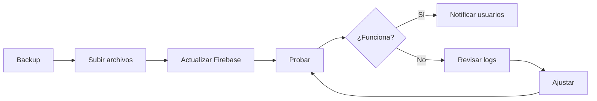

# 🍽️ SISTEMA DE ALMUERZO v2.0 - ACTUALIZACIÓN COMPLETA

## 📦 Paquete de Actualización
**Versión:** 2.0.0  
**Fecha:** Enero 2025  
**Desarrollado para:** Empaques Múltiples SRL

---

## 🎯 ¿QUÉ ES ESTA ACTUALIZACIÓN?

Esta actualización transforma el sistema de registro de almuerzo de un **sistema de registro diario manual** a un **sistema flexible con 4 opciones de registro**:

1. **📅 Registro Diario** - Registro manual cada día (modo original)
2. **📆 Registro Semanal** - Registro automático de toda la semana (Lun-Sáb)
3. **🗓️ Registro Mensual** - Calendario visual para seleccionar días del mes
4. **⚙️ Registro Personalizado** - Selección de días específicos de la semana

---

## 📁 ARCHIVOS INCLUIDOS EN ESTE PAQUETE

### ✅ Archivos del Sistema

| Archivo | Descripción | Acción |
|---------|-------------|--------|
| `database.js` | Funciones de base de datos actualizadas | **REEMPLAZAR** |
| `usuario.html` | Nueva interfaz de usuario | **REEMPLAZAR** |
| `usuario-main.js` | Lógica principal del usuario | **NUEVO** |
| `firebase-rules-updated.json` | Reglas de seguridad actualizadas | **APLICAR** |

### 📚 Documentación

| Archivo | Contenido |
|---------|-----------|
| `ACTUALIZACION.md` | Explicación completa de nuevas funcionalidades |
| `INSTALACION.md` | Guía paso a paso de instalación |
| `README.md` | Este archivo |

---

## 🚀 INSTALACIÓN RÁPIDA

### Opción 1: Instalación Completa (15 minutos)

Sigue la **guía detallada** en `INSTALACION.md`

### Opción 2: Instalación Express (5 minutos)

```bash
# 1. Hacer backup
cp -r /var/www/html/almuerzo /backup/almuerzo-backup

# 2. Subir archivos
cp database.js /var/www/html/almuerzo/js/
cp usuario.html /var/www/html/almuerzo/
cp usuario-main.js /var/www/html/almuerzo/js/

# 3. Actualizar reglas en Firebase Console
# (copiar contenido de firebase-rules-updated.json)

# 4. Probar el sistema
```

---

## 🎨 VISTA PREVIA DE LA INTERFAZ

### Página Principal del Usuario

```
┌─────────────────────────────────────────────────┐
│  CONFIGURACIÓN DE REGISTRO                      │
├─────────────────────────────────────────────────┤
│                                                 │
│  ¿Cómo deseas registrar tu asistencia?         │
│                                                 │
│  ┌──────────┐  ┌──────────┐  ┌──────────┐     │
│  │ 📅       │  │ 📆       │  │ 🗓️       │     │
│  │ Diario   │  │ Semanal  │  │ Mensual  │     │
│  │ Manual   │  │Automático│  │Calendario│     │
│  └──────────┘  └──────────┘  └──────────┘     │
│                                                 │
│  ┌──────────┐                                  │
│  │ ⚙️       │                                  │
│  │Personal. │                                  │
│  │Por días  │                                  │
│  └──────────┘                                  │
│                                                 │
│         [💾 Guardar Preferencia]               │
└─────────────────────────────────────────────────┘
```

---

## ✨ CARACTERÍSTICAS PRINCIPALES

### 1. Registro Semanal Automático
- ✅ Un clic para toda la semana
- ✅ Auto-registro al iniciar sesión
- ✅ Excluye domingos automáticamente
- ✅ Respeta días feriados

### 2. Calendario Mensual Interactivo
- ✅ Vista de todo el mes
- ✅ Selección múltiple de días
- ✅ Marcado visual de días registrados
- ✅ Domingos deshabilitados

### 3. Configuración Personalizada
- ✅ Selecciona días específicos (ej: Lun, Mié, Vie)
- ✅ Se repite semanalmente
- ✅ Registro automático en días seleccionados

### 4. Compatible con Modo Manual
- ✅ Funciona exactamente como antes
- ✅ Control total día a día
- ✅ Sin cambios para usuarios tradicionales

---

## 🔒 SEGURIDAD

### Nuevas Reglas de Firebase

Se agregó soporte para la colección `preferencias`:

```json
"preferencias": {
  "$uid": {
    ".read": "auth != null && $uid === auth.uid",
    ".write": "auth != null && $uid === auth.uid"
  }
}
```

**Características de seguridad:**
- ✅ Solo el usuario puede leer/escribir sus preferencias
- ✅ Admins pueden ver todas las preferencias
- ✅ Validación de datos en cliente y servidor
- ✅ Auditoría con timestamps

---

## 💾 ESTRUCTURA DE DATOS

### Nueva Colección: `preferencias`

```javascript
preferencias: {
  "userId123": {
    tipo: "semanal",              // diario, semanal, mensual, personalizado
    diasSeleccionados: [],        // ["lunes", "miercoles", "viernes"]
    fechaActualizacion: "2025-01-29T10:30:00Z"
  }
}
```

### Actualización en `asistencias`

```javascript
asistencias: {
  "asistenciaId456": {
    userId: "userId123",
    nombre: "Juan Pérez",
    email: "juan@empaques.local",
    fecha: "2025-01-29",
    hora: "12:45:30",
    timestamp: 1706534730000,
    tipoRegistro: "multiple"      // NUEVO: "multiple" o undefined
  }
}
```

---

## 📊 COMPATIBILIDAD

### ✅ Compatible con:
- Sistema actual (v1.0)
- Todos los navegadores modernos
- Dispositivos móviles
- Registros existentes
- Usuarios existentes

### ⚠️ Requisitos:
- Firebase Realtime Database
- Bootstrap 5.3+
- Font Awesome 6.4+
- JavaScript ES6+

---

## 🎓 CAPACITACIÓN DE USUARIOS

### Material Incluido
- ✅ Documentación completa
- ✅ Guía visual con ejemplos
- ✅ FAQ anticipado

### Sesión Recomendada (15 min)
1. Introducción a las 4 opciones (3 min)
2. Demo en vivo (5 min)
3. Práctica guiada (5 min)
4. Preguntas (2 min)

---

## 📈 BENEFICIOS

### Para Usuarios
- ⏱️ **Ahorro de tiempo:** No registrarse cada día
- 📅 **Planificación:** Ver y planear el mes completo
- 🎯 **Flexibilidad:** Elegir el modo que mejor funcione
- ✅ **Simplicidad:** Interfaz clara e intuitiva

### Para Administradores
- 📊 **Mejor data:** Registros más completos
- 🔮 **Previsibilidad:** Saber con anticipación
- 📉 **Menos consultas:** Usuarios más autónomos
- 💰 **ROI:** Mejor control de recursos

### Para la Empresa
- ♻️ **Menos desperdicio:** Compra exacta
- 💵 **Ahorro:** Optimización de recursos
- 😊 **Satisfacción:** Mejor experiencia empleado
- 📈 **Eficiencia:** Procesos automatizados

---

## 🐛 SOLUCIÓN DE PROBLEMAS

### Problema: "No veo las nuevas opciones"
**Solución:** Limpiar caché del navegador (Ctrl + Shift + Delete)

### Problema: "Error de permisos"
**Solución:** Verificar que las reglas de Firebase estén actualizadas

### Problema: "El calendario no funciona"
**Solución:** 
1. Verificar consola del navegador (F12)
2. Asegurar que `usuario-main.js` está cargando
3. Verificar conexión a Firebase

---

## 📞 SOPORTE

### Canales de Contacto
- **Email:** soporte.it@casaempaques.com
- **Teléfono:** Extensión IT
- **Horario:** Lun-Vie, 8:00 AM - 5:00 PM

### Recursos Adicionales
- 📖 Documentación completa: `ACTUALIZACION.md`
- 🔧 Guía de instalación: `INSTALACION.md`
- 💬 FAQ en el sistema

---

## 🔄 PROCESO DE ACTUALIZACIÓN



### Tiempo Total: ~15 minutos
- Backup: 5 min
- Instalación: 3 min
- Configuración Firebase: 2 min
- Pruebas: 5 min

---

## 🎯 CHECKLIST DE INSTALACIÓN

### Antes de Empezar
- [ ] Backup completo realizado
- [ ] Archivos descargados
- [ ] Acceso a servidor verificado
- [ ] Acceso a Firebase verificado

### Durante la Instalación
- [ ] Archivos subidos correctamente
- [ ] Reglas de Firebase actualizadas
- [ ] Pruebas básicas exitosas
- [ ] Sin errores en consola

### Después de Instalar
- [ ] Sistema funcionando correctamente
- [ ] Usuarios notificados
- [ ] Monitoreo configurado
- [ ] Documentación archivada

---

## 📅 ROADMAP FUTURO

### Versión 2.1 (Próximo trimestre)
- [ ] Notificaciones por email
- [ ] Exportar historial personal a PDF
- [ ] Estadísticas personales
- [ ] Temas de color personalizables

### Versión 3.0 (Próximo año)
- [ ] App móvil nativa
- [ ] Integración con Google Calendar
- [ ] Sistema de reservas con menú
- [ ] QR code para registro rápido

---

## 🏆 CRÉDITOS

**Desarrollado para:** Empaques Múltiples SRL  
**Versión:** 2.0.0  
**Fecha:** Enero 2025  
**Tecnologías:** Firebase, Bootstrap, JavaScript ES6+

---

## 📄 LICENCIA

© 2025 Empaques Múltiples SRL. Todos los derechos reservados.

Sistema de uso interno. No redistribuir sin autorización.

---

## 🎉 ¡LISTO PARA INSTALAR!

Este paquete contiene todo lo necesario para actualizar el sistema de almuerzo a la versión 2.0.

**Próximo paso:** Abrir `INSTALACION.md` para comenzar.

---

**¿Preguntas?** Contacta a soporte.it@casaempaques.com

**¡Gracias por mejorar continuamente nuestros sistemas! 🚀**
